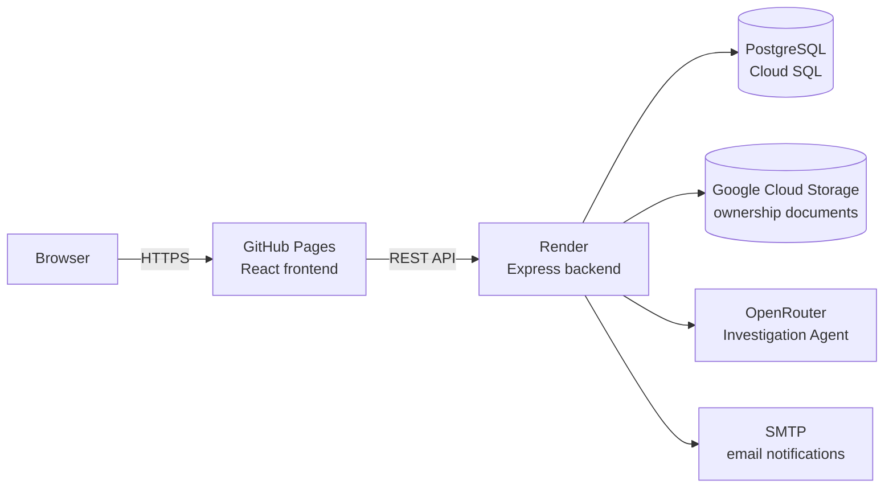

# AgriSafe Intelligence

**AI-assisted biosecurity risk monitoring for the Ontario–New York agricultural corridor.**

[](https://github.com/philmak999/AgriSafe-Intelligence/actions/workflows/ci.yml)
[](https://github.com/philmak999/AgriSafe-Intelligence/actions/workflows/deploy-pages.yml)

Livestock disease outbreaks move fast and get expensive quickly — a missed inspection or a late-caught risk signal can cascade into quarantines, failed audits, and lost trade access. AgriSafe Intelligence gives farmers and biosecurity staff a shared, real-time view of risk across a farming corridor, backed by an AI agent that investigates flagged farms on its own and an autonomous loop that acts on what it finds instead of waiting for someone to notice.

## Tech Stack

| Layer | Technology |
|---|---|
| Frontend | React 19, Vite, React Router, Chart.js |
| Backend | Node.js, Express |
| Database | PostgreSQL — Cloud SQL in production, Docker locally |
| File storage | Google Cloud Storage (farmer ownership documents) |
| AI | Nex-N2.5 Mini via OpenRouter — tool-calling risk-investigation agent |
| Email | Nodemailer over SMTP |
| Auth | JWT session cookies, bcrypt password hashing |
| Frontend hosting | GitHub Pages |
| Backend hosting | Render |
| CI/CD | GitHub Actions, Dependabot |

## Architecture



The frontend and backend deploy independently — GitHub Pages can't run a server, so the API lives on Render and is reached over CORS-restricted HTTPS. See [Deployment](#deployment) for how each piece ships.

## Quick Start

```bash
npm install
cp .env.example .env      # then fill in DATABASE_URL, GCS_*, OPENROUTER_API_KEY and SMTP_* (see below)
npm run db:up              # starts a local Postgres in Docker
npm run db:migrate         # applies the schema
npm run dev                # runs the frontend (Vite) + API server together
```

Open [http://localhost:5173](http://localhost:5173), or try the deployed version: **[philmak999.github.io/AgriSafe-Intelligence](https://philmak999.github.io/AgriSafe-Intelligence/)**

### Test accounts

Two accounts are pre-seeded so you can see both sides of the app immediately:

| Username | Password | Role | What you'll see |
|---|---|---|---|
| `admin` | `admin` | AgriSafe Scientist (staff) | Full access: corridor-wide data, MRI Model Config, Pathogen Trends, Automation Log, Farmer Approvals |
| `farmer` | `farmer` | Farmer | Registered farm (Seneca Valley Farms): Dashboard, Risk Timeline, Herd Records, Inspection Log, Compliance Reports |

```bash
node server/seedTestAccounts.js
```

## Features

### Core biosecurity dashboards
- **Dashboard** — role-gated: scientists see corridor-wide MRI trends, a biosecurity gauge, risk flags, and an inspection queue; farmers see their own farm's MRI score, risk level, vaccination coverage, and a corridor percentile comparison
- **Risk Timeline** — chronological feed of biosecurity risk events across the corridor
- **Herd Records** — searchable registry of every herd (species, head count, vaccination rate, MRI score, risk level)
- **Inspection Log** — recent and full inspection history with pathogen screen results
- **Compliance Reports** — regulatory filing status (FSMA 204, CFIA Part 11, USDA FSIS)

### Scientist-only tools
- **MRI Model Config** — live-adjustable sub-index weights (vaccination, antibiotics, herd density, outbreak proximity) with a real-time gauge preview
- **Pathogen Trends** — monthly detection trends and frequency breakdown by pathogen
- **Risk Investigation Agent** — click "Investigate →" on any flagged farm to run an OpenRouter-powered, tool-calling AI agent that pulls the herd record, risk timeline, inspection history, and compliance status, then returns a structured summary, findings, and recommendation
- **Automation Log** — a fully autonomous loop, running independently of any user session, that:
  - **Sources** newly-flagged (HIGH/MED risk) farms from live risk data
  - **Follows up** by running the Investigation Agent and emailing the findings to an ops inbox
  - **Tracks** every farm's status and history in Postgres, with a cooldown so it doesn't re-notify every cycle
  - **Reports** a live dashboard of tracked items and run history, plus a manual "Run cycle now" button

### Farmer accounts & self-service
- **Farmer registration** — signup with a bcrypt-hashed password, farm selection, and a required ownership-verification step:
  - **Herd ID match** — must match the exact ID on file for the selected farm
  - **Ownership document upload** — a deed, lease, government Premises ID letter, or inspection report (PDF/PNG/JPG/WEBP), stored in Google Cloud Storage
  - Account stays inactive until an AgriSafe staff member reviews and approves it
- **Farmer Approvals** (staff-only) — review queue showing each pending registration, a signed link to the uploaded document, and Approve/Reject actions with email notification either way
- **Farmer notification loop** — a second autonomous daily loop, independent of the risk-automation one:
  - **Reminders** — emails a farmer when an inspection or compliance filing is due soon or overdue (14-day window, 3-day cooldown by default)
  - **Weekly reports** — a full farm snapshot (risk level, MRI, vaccination, last/next inspection, compliance status, recent activity) emailed every Monday by default
- **Remove registration** — staff can revoke a farmer account at any time, freeing the farm to be re-registered

### Access control & data scoping
- Real authentication — hashed passwords, JWT session cookies, server-enforced role checks, not just hidden nav items
- Farmers only ever see their own farm's details across every page; a **corridor percentile** stat lets them compare performance without exposing any other farm's data
- Every internal ops tool (Investigation Agent, Automation Log, Farmer Approvals) returns a real 403 if a farmer session hits it directly

## Environment Variables

See `.env.example` for the full list with explanations. At minimum for local dev:

- `DATABASE_URL` — Postgres connection string; the default value matches `npm run db:up`'s local Docker container as-is
- `GCS_PROJECT_ID` / `GCS_BUCKET_NAME` / `GCS_KEY_JSON_BASE64` — a Google Cloud Storage bucket and service-account key for storing farmer ownership documents
- `OPENROUTER_API_KEY` — key from [openrouter.ai/keys](https://openrouter.ai/keys), powers the Investigation Agent
- `SMTP_HOST` / `SMTP_PORT` / `SMTP_USER` / `SMTP_PASS` — needed for real emails (reminders, weekly reports, approval notices); Gmail App Passwords work well here
- `JWT_SECRET` — random string signing login sessions; generate one with `node -e "console.log(require('crypto').randomBytes(32).toString('hex'))"`

Everything else (loop intervals, reminder windows, seed account credentials) has a sensible default.

## Available Scripts

| Script | What it does |
|---|---|
| `npm run dev` | Runs the Vite frontend and the Express API server together |
| `npm run dev:web` | Frontend only |
| `npm run dev:api` | API server only (auto-restarts on file changes) |
| `npm run build` | Builds the frontend for production to `dist/` |
| `npm run preview` | Serves the production build locally |
| `npm run lint` | ESLint over `src/` and `server/` |
| `npm run test` | Runs the Vitest suite in watch mode |
| `npm run test:run` | Runs the Vitest suite once (used in CI) |
| `npm run db:up` | Starts a local Postgres container via Docker Compose |
| `npm run db:down` | Stops the local Postgres container |
| `npm run db:migrate` | Applies any pending SQL migrations to `DATABASE_URL` (also runs automatically before `npm start`) |
| `node server/seedTestAccounts.js` | (Re-)creates the `admin`/`admin` and `farmer`/`farmer` test accounts |

## Deployment

The frontend and backend are two independently deployed services with no shared runtime.

### Frontend — GitHub Pages
Built and published by [`deploy-pages.yml`](.github/workflows/deploy-pages.yml) on every push to `main`. `VITE_API_BASE_URL` is baked into the static build at compile time (via a GitHub Actions repo variable) so the deployed frontend knows where to reach the API — GitHub Pages serves static files only and can't proxy requests itself.

### Backend — Render
The Express API runs as a Render web service, auto-deployed from this repo. [`render.yaml`](render.yaml) is a Render Blueprint — infrastructure as code for the service's build/start commands, health check path, and environment variable slots. Secrets (`DATABASE_URL`, `GCS_*`, `OPENROUTER_API_KEY`, `SMTP_*`, `JWT_SECRET`) are entered in the Render dashboard, never committed. On every deploy, the `prestart` npm hook applies any pending Postgres migrations before the server starts, and Render polls `/api/health` (which checks both process liveness and DB connectivity) for zero-downtime rollouts.

### Database & file storage — Google Cloud
Production data lives in a Cloud SQL for PostgreSQL instance (reached over its public IP with SSL enforced) and farmer ownership documents live in a Google Cloud Storage bucket, served back to staff via short-lived signed URLs rather than public links. Locally, the same schema runs against a disposable Postgres container (`npm run db:up`) via the same SQL migrations in [`server/db/migrations/`](server/db/migrations/), and uploads go to the same GCS bucket.

## CI/CD

- **[ci.yml](.github/workflows/ci.yml)** — runs on every pull request and every push to a non-`main` branch: spins up a throwaway Postgres service container, then `npm ci` → lint → migrate → test → build. A branch protection rule on `main` requires this check to pass before merge.
- **[deploy-pages.yml](.github/workflows/deploy-pages.yml)** — runs on push to `main`: repeats the same Postgres + lint/migrate/test/build gate as a second, independent line of defense, publishes `dist/` to GitHub Pages, then does a best-effort health check against the deployed backend so a broken deploy shows up in the Actions tab instead of a support email.
- **[dependabot.yml](.github/dependabot.yml)** — weekly PRs for outdated or vulnerable npm and GitHub Actions dependencies.

Repo variables to set (Settings → Secrets and variables → Actions → Variables): `VITE_API_BASE_URL` (required, used by the frontend build) and `API_BASE_URL` (optional, same value without the `VITE_` prefix, enables the post-deploy health check).

## Project Structure

- `src/pages` — one file per routed page
- `src/components` — reusable UI building blocks
- `src/data/mockData.js` — static fixture data (herds, risk flags, inspections, compliance reports); shared by the UI and the backend agent/automation tools
- `src/AuthContext.jsx` — frontend session state (current user, login/logout)
- `src/routes.js` — route paths and per-page Topbar title/subtitle metadata
- `server/index.js` — Express app: routes, middleware, server bootstrap
- `server/agent.js` — the AI risk-investigation agent (OpenRouter tool-calling loop)
- `server/automation.js` / `server/farmerLoop.js` — the two autonomous background loops
- `server/auth.js` — JWT sessions and role-gating middleware
- `server/gcs.js` — Google Cloud Storage upload / signed-URL / delete helpers
- `server/staffStore.js`, `server/farmerStore.js`, `server/store.js` — the three persisted-data stores (staff accounts, farmer accounts, automation records/history/runs), all backed by Postgres
- `server/db/` — the Postgres connection pool (`pool.js`), the migration runner (`migrate.js`), and hand-written SQL migrations (`migrations/`)
